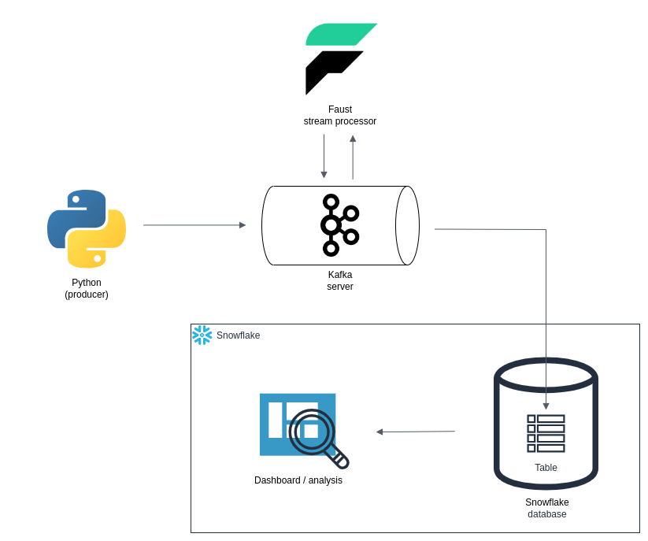

# kafka_etl_cars_data



This project, **kafka_etl_cars_data**, is designed to demonstrate a simple ETL (Extract, Transform, Load) pipeline using Kafka, Faust, and Snowflake. It ingests data into a Kafka topic, processes it in real-time using Faust, and finally stores the transformed data in a Snowflake table.

## Project Architecture

The project follows the following architecture:

1. **Data Ingestion:** Python scripts are used to ingest data into a Kafka topic. This data can be any kind of structured or semi-structured data, such as car-related information.

2. **Stream Processing:** [Faust](https://faust.readthedocs.io/) is used for real-time stream processing. Faust allows you to define stream processing tasks and workflows easily.

3. **Data Storage:** The processed data is loaded into a Snowflake table. [Snowflake](https://www.snowflake.com/) is a cloud-based data warehousing platform known for its flexibility and scalability.

## Prerequisites

Before you can run this project, you need to have the following software installed:

1. **Kafka:** Kafka is a distributed event streaming platform. You can download and install Kafka from the official [Kafka website](https://kafka.apache.org/downloads).

2. **Faust:** Faust is a Python stream processing library. Install Faust using pip:

```bash
pip install faust
```

3. **Snowflake:** You need access to a Snowflake instance. If you don't have one, you can sign up for a free trial on the [Snowflake website](https://www.snowflake.com/).

## Getting Started

Follow these steps to get started with the project:

1. **Clone or Download this Project:** Clone or download this project repository to your local machine.

```bash
git clone https://github.com/...
```

2. **Navigate to the Project Directory:** Change your working directory to the root of the cloned project.

```bash
cd path/to/project
```

3. **Start the Kafka environment:**
All detail you can find in [Kafka quickstart guide](https://kafka.apache.org/quickstart)

4. **Topic creation:** 
Create topic inside Kafka `car_speed` (or something else, but don't forget to change the name of topic inside `main.py` and `producer.py`)

5. **Configure Snowflake connection:**
Locate the section of the code inside `main.py` where the credentials needs to be added.

```python
user=""
password=""
account="" 
```

6. **Snowflake database and table creation**
Inside Snowflake warehouse create corresponding database and table (don't forget to place those names inside `main.py` as well)

&emsp; &emsp; &nbsp; Detail instructions can be found here: [Snoflake documentation](https://docs.snowflake.com/)

5. **Run the Faust stream processing application:**

```bash
faust -A main worker -l info
```

6. **Data ingestion:**
Run the Kafka data ingestion script to start sending data to Kafka:

```bash
python producer.py
```

&emsp; &emsp; &nbsp; The processed data will be loaded into the Snowflake table as per your configuration.

7. **Create dashboard inside Snowflake:**
[Instruction](https://docs.snowflake.com/en/user-guide/ui-snowsight-dashboards)

That's it! If you encounter any issues or need further assistance, feel free to refer to the Kafka and Snowflake documentation or reach out to the project community for support.